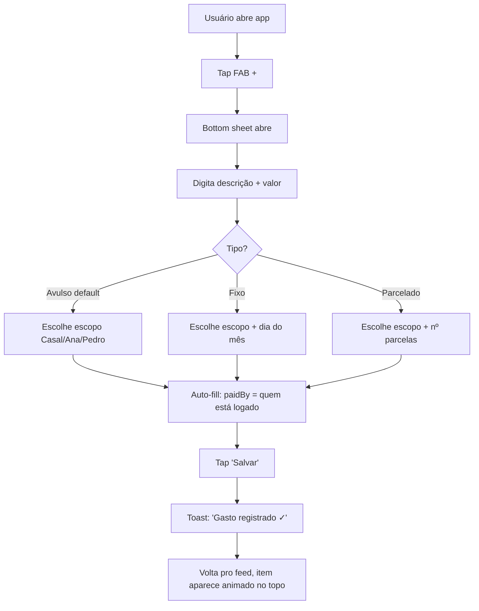
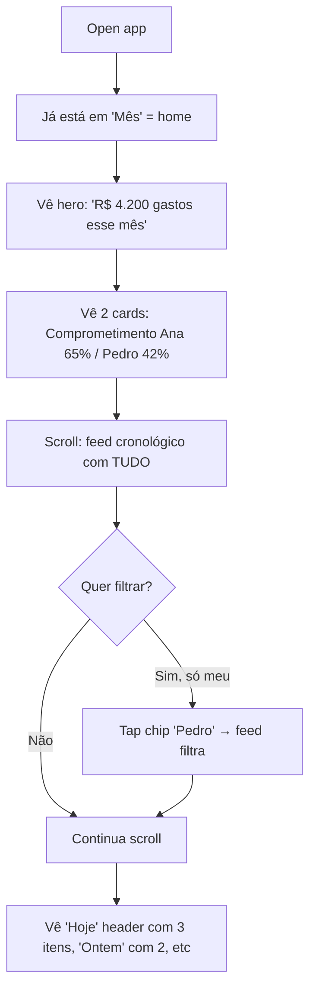
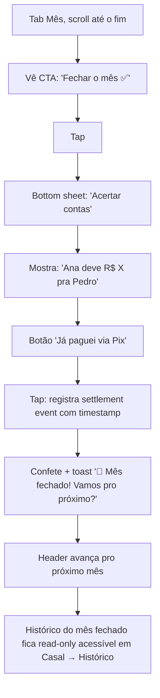

# UX Audit — Casal no Azul

> **Autor:** UX Designer (Design Squad)
> **Data:** 2026-05-13
> **Versão analisada:** estado atual do repo (`src/components/*`)
> **Stack:** Next.js 14 App Router + TS + React 18, inline styles, mobile-first (`maxWidth: 480`)
> **Escopo:** auditoria heurística + reestruturação de IA + flows + estados + roadmap priorizado.
> **Restrição:** nenhuma alteração de código. Só pesquisa e proposta.

---

## TL;DR (para o impaciente)

1. O app sofre de **fragmentação de despesas em 4 tipos diferentes** (Casal avulso, Pessoal avulso, Fixos, Parcelas) — o usuário precisa categorizar mentalmente *antes* de registrar. **Isso quebra Jobs-to-be-Done básico** ("eu gastei X, registra aí").
2. **6 tabs no bottom nav viola Hick's Law** e diluem a primary action. Reduzimos para **4 tabs + 1 FAB de "+ Gasto"** que aceita qualquer tipo.
3. **Não existe conceito de "mês"** — gastos avulsos vivem pra sempre, impossibilitando o JTBD "ver quanto a gente gastou esse mês". Proposta: introduzir **billing cycle** (mês corrente / histórico).
4. **A tela única de despesas pedida pelo user vira a nova "Mês"** (homepage rebatizada), substituindo o dashboard atual de 5 cards empilhados sem hierarquia.
5. **Mental model do casal** (Indi Young): casais pensam em momentos ("agora", "esse mês", "o que falta pagar"), **não em categorias técnicas** (avulso/fixo/parcela). A IA atual reflete o modelo do *desenvolvedor*, não do usuário.

---

## 1. UX Audit dos 10 issues mapeados

Cada issue foi avaliado em **Severidade** (Alta / Média / Baixa) usando os critérios de Nielsen (frequência × impacto × persistência) e ancorado num princípio canônico.

---

### Issue #1 — 6 tabs no bottom nav

- **Severidade:** Alta
- **Princípio violado:** Hick's Law (tempo de decisão cresce com log do número de opções); Nielsen #4 (consistência e padrões — apps financeiros típicos usam 3-5 tabs).
- **Sintoma:** usuário hesita ao decidir onde adicionar um gasto. Tab "Casal" vs "Fixos" vs "Parcelas" requer julgamento técnico antes de toque. Em telas <360px, labels truncam ou caem em 2 linhas.
- **Proposta concreta:**
  - Reduzir para **4 tabs**: `Mês | Recorrentes | Metas | Casal` (configuração).
  - "Fixos" + "Parcelas" viram **sub-views dentro de `Recorrentes`** com um segmented control no topo (`Fixos / Parcelas`).
  - "Gastos Casal" e "Pessoal" são **fundidos num feed único na aba `Mês`** com filtros chip (`Tudo / Casal / Ana / Pedro`).
  - Primary action sai da tab e vira **FAB persistente** (Material Design pattern, validado em apps financeiros como Mobills, Organizze, Splitwise).

---

### Issue #2 — Dashboard com 5+ cards empilhados sem hierarquia

- **Severidade:** Alta
- **Princípio violado:** Gestalt (sem ponto focal); Visual Hierarchy (Yantis & Egeth, atenção visual); Nielsen #8 (minimalismo).
- **Sintoma:** Card "Quem deve" (a *única coisa* que importa) divide protagonismo com "Composição", "Renda comprometida", "Mini fixos", "Mini parcelas", "Pessoal" — todos com mesmo peso visual (Card branco, mesmo padding, mesmo shadow).
- **Proposta concreta:**
  - **Hero card único** no topo, altura ~30% da viewport (~240px), full-bleed (sai do `maxWidth: 480` em mobile, vira card glass no desktop): mostra o **balanço** em 56px Poppins 900. Sem competição.
  - Abaixo: **2 cards em grid 2×2** (saldo do mês, renda comprometida) — secundários, 16px text.
  - **Listas (fixos ativos, parcelas em aberto)** viram **link rows** com chevron `→`, não cards. Acelera scan (Fitts' Law: alvos amplos e horizontais).
  - Cards `composição`, `pessoal resumo`, `renda comprometida` viram **drill-downs** acessíveis por tap, não tudo na home.

---

### Issue #3 — Primary action escondida em tab

- **Severidade:** Alta
- **Princípio violado:** Fitts' Law (alvo primário deve ser grande e próximo ao polegar); Nielsen #7 (eficiência); Jobs-to-be-Done #1 do app.
- **Sintoma:** Para registrar um gasto, o user precisa: (1) escolher tab "Casal" ou "Pessoal" ou "Fixos" ou "Parcelas" — uma decisão *técnica*, (2) achar o form no topo, (3) preencher 4 campos. Friction altíssimo para a ação mais frequente.
- **Proposta concreta:**
  - **FAB redondo 64px**, bottom-right, 16px above bottom nav (`bottom: 100px`, `right: 16px`), cor primária com sombra elevada. Símbolo `+`.
  - Tap abre **bottom sheet modal** com form unificado de despesa (descrição, valor, tipo via segmented [Avulso / Fixo / Parcelado], escopo [Casal / Ana / Pedro], categoria).
  - **Type inference**: se valor > X e categoria == "Eletrodoméstico", sugere "parcelado?". Reduz cognitive load.
  - **Atalho de teclado/voice** futuro: "+50 mercado casal" parser.

---

### Issue #4 — Cada seção inventa seu próprio gradient

- **Severidade:** Média
- **Princípio violado:** Sistemas de Design (Brad Frost — atomic design / design tokens); Nielsen #4 (consistência).
- **Sintoma:** Casal usa `#FF6B6B → #4ECDC4`, Pessoal usa `#a78bfa → #60a5fa`, Fixos `#8b5cf6 → #a855f7`, Parcelas `#f59e0b → #fb923c`. Cada gradient só aparece naquela tab. Resultado: **app parece 4 apps diferentes**. Usuário perde sense of place.
- **Proposta concreta:**
  - **Token system** (handoff pro design-system-architect):
    - `--color-couple` (azul/teal — *casal no azul*, alinha com o nome do produto)
    - `--color-person-a` (renda A, persistente)
    - `--color-person-b` (renda B, persistente)
    - `--color-warning`, `--color-success`, `--color-fixed`, `--color-installment`
  - **1 gradient master** para hero do app (couple → success). Sub-páginas usam **flat color + token semântico**, não outro gradient.
  - **NB:** hoje o produto se chama "Casal no Azul" mas o gradient hero é vermelho `#FF6B6B`. **Disconnect de branding.** Hero deveria ser azul.

---

### Issue #5 — Spacing arbitrário (padding 12, 14, 16, 18, 20)

- **Severidade:** Média
- **Princípio violado:** 4pt/8pt grid system (Material, HIG, Tailwind); previsibilidade visual.
- **Sintoma:** `padding: '14px 18px'` em hero, `'14px 16px'` em ExpenseRow, `'20px 22px'` em Card, `'16px 18px'` em parcela. Não há sistema. Resulta em alinhamentos quebrados em scroll lateral.
- **Proposta concreta:**
  - Adotar **escala 4pt**: `4, 8, 12, 16, 20, 24, 32, 40, 56`.
  - Tokens: `space-xs (4), space-sm (8), space-md (16), space-lg (24), space-xl (32)`.
  - Card padrão: `padding: 16px 20px`. Hero: `padding: 24px 24px`. Row: `padding: 12px 16px`.
  - (Handoff: design-system-architect criará tokens em CSS vars; ui-engineer migra estilos.)

---

### Issue #6 — Mobile-only (480px centered)

- **Severidade:** Média
- **Princípio violado:** Responsive design (Ethan Marcotte); WCAG 1.4.10 (Reflow).
- **Sintoma:** Em desktop, o app fica como uma *coluna vertical claustrofóbica* no centro de uma tela 1920×1080. Casal não vai usar isso no notebook? Provavelmente sim, ao fazer planejamento mensal (JTBD: "sentar pra resolver as contas").
- **Proposta concreta:**
  - **Breakpoints:**
    - `< 640px`: single column, FAB, bottom nav (estado atual).
    - `≥ 640px e < 1024px`: 2 columns (sidebar left 240px com nav vertical + main feed). FAB vira botão no header.
    - `≥ 1024px`: 3-column dashboard (sidebar nav | feed do mês | preview/detail). Layout estilo Linear / Notion.
  - **Pattern**: usar `clamp()` para tipografia fluida.
  - **Reflow**: garantir que zoom 200% (acessibilidade) não quebre.

---

### Issue #7 — IA confusa: "Casal" em 3 contextos

- **Severidade:** **CRÍTICA (Alta)** — esse é o problema-raiz que gera todos os outros.
- **Princípio violado:** Mental Model (Indi Young — *Mental Models: Aligning Design Strategy with Human Behavior*); Nielsen #2 (match between system and real world); Information Architecture (Rosenfeld & Morville — *Information Architecture for the Web*).
- **Sintoma:** "Casal" significa três coisas:
  1. **Tab `💑 Casal`** = gastos avulsos compartilhados.
  2. **Scope `casal` em Fixos** = recorrentes compartilhados.
  3. **Scope `casal` em Parcelas** = parcelados compartilhados.
  E "Pessoal" = avulsos individuais, mas fixos pessoais ficam em `Fixos` (não em `Pessoal`), e parcelas pessoais ficam em `Parcelas` (não em `Pessoal`). **A taxonomia é cruzada por dois eixos** (tipo × escopo) mas a navegação só expõe um eixo (tipo). User precisa fazer matrix mental.
- **Proposta concreta:**
  - **Reorganizar IA pelo eixo dominante do mental model do usuário:** pessoas pensam **"quando paguei"** + **"quem pagou"**, não "que tipo de despesa".
  - **Eixo principal = tempo** (`Este mês`, `Recorrentes / contínuos`, `Quitados`).
  - **Eixo secundário = escopo** (filtros chip: `Tudo / Casal / Ana / Pedro`).
  - **Eliminar** tabs `Casal` e `Pessoal` como containers — viram filtros.
  - Ver seção 2 (IA proposta).

---

### Issue #8 — Sem feedback de erro/validação (usa `alert()`)

- **Severidade:** Alta (afeta primeiro uso — onboarding)
- **Princípio violado:** Nielsen #9 (ajudar usuários a reconhecer, diagnosticar e recuperar de erros); WCAG 3.3.1 (Error Identification); Don Norman (signifiers).
- **Sintoma:** `Setup.tsx` linha 26 dispara `alert('Preenche os nomes e escolhe o método 😅')`. Em mobile esse alert é nativo, intrusivo, sem styling, sem indicação de *qual* campo está errado.
- **Proposta concreta:**
  - **Inline validation** abaixo de cada campo: borda vermelha + mensagem em texto pequeno vermelho, ícone `⚠️`.
  - **Blocking errors** (impede submit) vs **warnings** (permite avançar): valor zero é warning, nome vazio é blocking.
  - **Empty state do botão**: desabilitar até campos obrigatórios estarem preenchidos, com microcopy "Preencha os nomes para continuar".
  - **Toast** (snackbar) para success/info pós-ação ("Gasto registrado ✓", 2s).
  - Substituir todos os `alert()` no codebase (Setup linha 26; verificar outros).

---

### Issue #9 — Sem tela única de TODAS as despesas (REQUISITO NOVO)

- **Severidade:** Alta — bloqueante do JTBD primário.
- **Princípio violado:** Jobs-to-be-Done framework (Clayton Christensen / Tony Ulwick); Gestalt (proximidade).
- **JTBD não atendido:** *"Como casal, quero ver tudo que rolou esse mês num só lugar, pra saber pra onde foi o dinheiro."* Hoje preciso visitar 4 tabs e somar mentalmente.
- **Proposta concreta:**
  - **Nova home: aba `Mês`** (substitui `Início`).
  - **Feed cronológico unificado** de todas as despesas (avulsas + fixas debitadas + parcelas debitadas) do mês corrente, com:
    - Ícone categoria + descrição.
    - Valor + tag "quem pagou" + tag "casal/pessoal" + tag "tipo" (avulso / fixo / parcela 3/12).
    - Agrupamento por dia (sticky header `Hoje`, `Ontem`, `12 mai`).
  - **Header sticky** com `R$ total gasto`, `quanto falta na renda` e seletor de mês (`◄ Mai 2026 ▶`).
  - **Filtros chip** logo abaixo: `Tudo | Casal | Ana | Pedro | Categorias ▾`.
  - Tap em item abre **bottom sheet de detalhe** (edita / remove / muda categoria).
  - **Hero "Quem deve pra quem"** continua acima do feed (sticky? ou colapsa em scroll).

---

### Issue #10 — Sem conceito de "mês" / billing cycle

- **Severidade:** Alta (bloqueante de retenção a longo prazo)
- **Princípio violado:** Temporal Modeling; Mental Model financeiro real do brasileiro (vence dia 5 / 10 / 15).
- **Sintoma:** Gastos avulsos persistem pra sempre no array. Após 3 meses, lista vira incontornável. Não há "fechar o mês". Saldo "quem deve" inclui gasto de janeiro que já foi acertado.
- **Proposta concreta:**
  - Cada `Expense`, `PersonalExpense` ganha `date: ISO8601` (defaultar `new Date()` no add).
  - Cada `Installment` já tem `paidParcelas` — converter para histórico de pagamentos com data.
  - **Conceito de "fechar mês"**: botão `✅ Acertamos as contas` na tela `Mês` — registra "settle event" com snapshot do balance, e zera o cálculo para o próximo ciclo. Indi Young insight: *o ato de acertar é parte do ritual emocional do casal*, precisa ser celebrado (toast com confete? "🎉 Mês fechado!").
  - **Histórico**: tab `Mês` permite navegar meses anteriores read-only.
  - **Carry-over**: fixos e parcelas em curso são "instanciados" automaticamente no novo mês.

---

## 2. Information Architecture proposta

### ANTES (estado atual)

```
Casal no Azul (estado atual)
│
├─ Setup (one-time)
│
└─ Bottom Nav (6 tabs)
   ├─ 🏠 Início          → 5+ cards empilhados (dashboard)
   ├─ 📌 Fixos            → form + lista de recorrentes (scope = casal | A | B)
   ├─ 💑 Casal            → form + lista de avulsos compartilhados
   ├─ 👤 Pessoal          → form + lista de avulsos individuais (A + B)
   ├─ 💳 Parcelas         → form + lista de parcelados (scope = casal | A | B)
   └─ 🎯 Metas            → form + lista de objetivos
```

Problema: dois eixos (tipo × escopo) mas só um exposto na nav. Usuário sempre precisa cruzar mentalmente.

---

### DEPOIS (proposta)

```
Casal no Azul (proposta)
│
├─ Setup
│   ├─ Nomes + rendas + método (já existe)
│   └─ Multi-device (Supabase, já decidido) — código de convite no fim do setup
│
├─ Header global (sticky)
│   ├─ Avatares casal + nome
│   ├─ Seletor de mês  ◄ Mai 2026 ▶
│   └─ Settings (gear) → método de divisão, edit nomes, sair
│
├─ FAB persistente "+"                     ← PRIMARY ACTION GLOBAL
│   └─ Bottom sheet: Novo gasto
│       ├─ Descrição
│       ├─ Valor
│       ├─ Tipo  [ Avulso | Fixo | Parcelado ]    ← segmented
│       ├─ Escopo [ 💑 Casal | 👤 Ana | 👤 Pedro ]
│       ├─ Quem pagou [ Ana | Pedro ]
│       ├─ Categoria
│       └─ (se Parcelado: nº parcelas, já pagas)
│
└─ Bottom Nav (4 tabs)
   │
   ├─ 📅 Mês             ← NOVA HOME (substitui Início)
   │   ├─ Hero "Quem deve pra quem" (full-bleed, 30% viewport)
   │   ├─ Cards 2×2: Total gastos mês | Comprometimento renda
   │   ├─ Filtros chip: [ Tudo | 💑 | 👤 Ana | 👤 Pedro ]
   │   ├─ Feed cronológico (Hoje, Ontem, dd/mm)
   │   │   ├─ Despesas avulsas
   │   │   ├─ Fixos debitados (auto, dia 1 ou data custom)
   │   │   └─ Parcelas debitadas (auto, todo mês até quitar)
   │   ├─ FAB "+" (overlap bottom)
   │   └─ Botão "✅ Fechar o mês" no final do scroll
   │
   ├─ 🔁 Recorrentes      ← FUNDE Fixos + Parcelas
   │   ├─ Segmented top: [ Fixos | Parcelados ]
   │   ├─ Sub-view "Fixos"
   │   │   ├─ Resumo 2×2 (Casal/mês, Ana/mês, Pedro/mês, Total)
   │   │   ├─ Lista Ativos (toggle pausar)
   │   │   └─ Lista Pausados
   │   └─ Sub-view "Parcelados"
   │       ├─ Impacto mensal (4 cards)
   │       ├─ Em andamento (cards expansíveis, parcela a parcela)
   │       └─ Quitados
   │
   ├─ 🎯 Metas            ← INALTERADO conceitualmente
   │   └─ (forms + lista + progresso)
   │
   └─ 👥 Casal            ← Configuração / status do casal
       ├─ Quem é quem (edit nomes, rendas)
       ├─ Método de divisão (50/50 ↔ proporcional)
       ├─ Multi-device (código de convite, gerenciar dispositivos)
       ├─ Histórico de fechamentos de mês
       └─ Export CSV / backup
```

### Diff resumido

| Eixo | Antes | Depois |
|---|---|---|
| Tabs | 6 | 4 + FAB |
| Forms de despesa | 4 (em tabs diferentes) | 1 (no FAB) |
| Como encontro um gasto | escolho tab certa | scroll feed cronológico + filtro |
| Onde edito nomes | "voltar ao Setup"? (não tem) | Tab "Casal" → Configuração |
| Conceito de mês | inexistente | seletor no header + fechamento |
| Hierarquia visual home | 5 cards iguais | 1 hero + 2 secundários + feed |

### Justificativa do nome "Casal"

A tab `👥 Casal` agora **é** o que o nome promete: o lugar onde você gerencia a relação financeira do casal (config, método, sync, histórico). Acaba a ambiguidade "Casal = avulsos compartilhados" — `Casal` vira o **container do contrato** entre os dois.

---

## 3. User Flows redesenhados

### Flow A — Adicionar um gasto (o que o user faz 10x/dia)

**Antes (estado atual, 6-8 toques):**

```
Open app
  → Decisão mental: "esse gasto é avulso? fixo? parcelado? do casal? meu? do A ou B?"
  → Tap tab certa (Casal / Pessoal / Fixos / Parcelas)
  → Scroll até form (form fica no topo, ok, mas exposto sempre)
  → Tap input descrição
  → Tap input valor
  → Tap dropdown "quem pagou"
  → Tap dropdown "categoria"
  → Tap "Adicionar"
  → (se errei a tab, refazer tudo)
```

**Depois (3-5 toques, intent-first):**



**Otimizações:**
- `paidBy` default = pessoa logada no device (multi-device sync já decidido).
- Tipo default = `Avulso` (o mais frequente).
- Escopo default = último usado (recency).
- Categoria pode ser inferida de descrição via lookup ("mercado" → `Mercado`).

---

### Flow B — Ver quanto gastei este mês

**Antes (impossível na real, requer cálculo mental):**

```
Tab Início → vê "Total casal/mês: R$ X" (mas não inclui pessoal)
Tab Casal → soma de avulsos casal
Tab Pessoal → soma de avulsos pessoal
Tab Fixos → vê "Total/mês" no resumo
Tab Parcelas → vê "Total/mês" no impacto
→ User mentalmente soma 4 números
→ User não consegue ver quais foram os itens individuais sem trocar de tab 4x
```

**Depois:**



**Insight chave:** o feed responde **3 perguntas em 1 tela**: *quanto*, *no que*, *quando*.

---

### Flow C — Acertar contas com parceiro

**Antes:**
```
Tab Início → vê quem deve quanto
→ Faz Pix manualmente
→ Volta pro app, deleta gastos? Pausa fixos? Não há mecanismo claro de "reset"
→ Mês que vem o saldo continua sujo com gastos antigos
```

**Depois:**



**Detalhe emocional (Indi Young):** o ato de fechar o mês precisa ser **celebratório**. É o momento em que o casal sente que está "em dia". Pequenas micro-interações (confete, animação de zerar contador) reforçam o vínculo positivo com o app.

---

## 4. Mental Model alignment

### Mental Model real do casal (baseado em conhecimento de pesquisa em fintech BR + Indi Young)

Casais em relacionamento financeiro compartilhado **não pensam em taxonomias técnicas**. Eles pensam em:

1. **Momento temporal** — "esse mês", "mês passado", "todo mês" (recorrente).
2. **Atribuição** — "eu paguei", "ele/ela paguei", "a gente combinou meio a meio".
3. **Sensação** — "tá apertado", "sobrou", "tô devendo pra ela", "ela tá devendo pra mim".
4. **Ritual** — "vou acertar com ele no fim do mês", "Pix da divisão", "a gente faz no dia 5".

### Mental Model que o app projeta hoje

O app força o usuário a categorizar **antes de registrar**:
- Isso é avulso? → tab Casal/Pessoal
- Isso é fixo? → tab Fixos
- Isso é parcelado? → tab Parcelas
- É do casal? Meu? Dele/dela?

**O usuário não pensa "isso é avulso ou fixo".** Ele pensa "eu gastei 80 reais no mercado".

A taxonomia *deveria emergir do registro*, não preceder o registro.

### Citação aplicada (Indi Young, *Practical Empathy*, 2015)

> *"The work is to listen for the underlying intent — what someone is trying to accomplish — and design the system to support that intent, not to require the user to translate their goal into the system's vocabulary."*

**Aplicação ao Casal no Azul:**
- Vocabulário do sistema hoje: `Scope: 'casal' | 'A' | 'B'`, `paidBy`, `active`, `paidParcelas`.
- Vocabulário do usuário: "esse foi nosso", "ela paga", "tá pausado", "ainda faltam X parcelas".
- **Tradução necessária**: labels, microcopy, e ordem dos campos no form devem espelhar o vocabulário humano. Ex: em vez de "Scope" → "Esse gasto é..." com opções "Nosso 💑 / Só meu 👤 / Só dela/dele 👤".

### Jobs-to-be-Done (Clayton Christensen)

Top 5 JTBDs do app, ordenados por frequência:

| # | JTBD | Frequência | Atendido hoje? |
|---|---|---|---|
| 1 | "Quando gasto algo, quero registrar rápido pra não esquecer" | Diária | ❌ requer escolher tab |
| 2 | "Quero ver quanto a gente gastou esse mês" | Semanal | ❌ fragmentado em 4 tabs |
| 3 | "Quero saber quem deve quem agora" | Diária | ✅ existe no Início |
| 4 | "Quero acertar as contas e fechar o mês" | Mensal | ❌ não existe ciclo |
| 5 | "Quero ver pra onde tá indo o dinheiro (categorias)" | Mensal | ❌ não há breakdown por categoria |

**Insight:** os 4 JTBDs mais frequentes estão mal atendidos. A IA proposta resolve todos.

---

## 5. Empty states e error states

Estados vazios são **oportunidades de onboarding contextual**, não placeholders genéricos. Hoje o app usa `"Nenhum gasto avulso ainda 🌵"` — passivo, sem CTA, não ensina.

### Inventário de estados vazios atuais e propostas

#### 5.1 — Tab Mês (sem gastos no mês corrente)

**Hoje:** ❌ não existe (a tab é nova).

**Proposta:**
```
┌────────────────────────────────┐
│                                │
│        💰 (ilustração)         │
│                                │
│   Esse mês ainda tá zerado     │
│                                │
│ Registre o primeiro gasto pra  │
│  começar a acompanhar vocês    │
│  dois.                          │
│                                │
│      [ + Adicionar gasto ]     │
│                                │
│   ─ ou ─                       │
│                                │
│  💡 Comece pelos fixos do mês  │
│     (aluguel, Netflix...)      │
│     → Ir pra Recorrentes       │
│                                │
└────────────────────────────────┘
```

**Princípio:** Onboarding progressivo (Whitney Hess) + dual CTA (primary = registrar agora, secondary = pré-popular fixos = path to first value mais robusto).

---

#### 5.2 — Setup, campos obrigatórios não preenchidos

**Hoje:** `alert('Preenche os nomes e escolhe o método 😅')` — bloqueante, nativo, feio.

**Proposta:**
- Botão `Começar! 🚀` **desabilitado** até `nameA && nameB && method`.
- Microcopy abaixo do botão: `"Falta: nome de B, método de divisão"` (texto que atualiza em real-time).
- Se user insistir em clicar (botão desabilitado mas tap detectado), **shake animation** nos campos faltantes + scroll suave até o primeiro.
- Cor de erro: `--color-warning` (laranja, não vermelho — vermelho é alarme, laranja é "ei, falta algo").

---

#### 5.3 — Tab Recorrentes / Fixos vazia

**Hoje:** `"Nenhum custo fixo cadastrado 📋 / Adicione aluguel, Netflix, academia..."`

**Proposta:** **Quick-add de fixos comuns** (catalog-based onboarding, padrão YNAB / Mobills):
```
┌────────────────────────────────┐
│   📌 Fixos do mês              │
│   Tipo os que vocês têm:       │
│                                │
│ ┌──────────┐ ┌──────────┐      │
│ │ 🏠 Aluguel│ │ 📺 Netflix│      │
│ └──────────┘ └──────────┘      │
│ ┌──────────┐ ┌──────────┐      │
│ │💪 Academia│ │ 💡 Luz    │      │
│ └──────────┘ └──────────┘      │
│ ┌──────────┐ ┌──────────┐      │
│ │ 📶 Internet│ │  +Outro  │     │
│ └──────────┘ └──────────┘      │
│                                │
└────────────────────────────────┘
```

Tap em chip → abre bottom sheet pré-preenchido só pedindo valor + escopo. 3 toques pra cadastrar.

---

#### 5.4 — Tab Recorrentes / Parcelas vazia

**Hoje:** `"Nenhum parcelado cadastrado 🛒"`

**Proposta:** Empty state com 2 patterns simulados ("Geladeira em 12x" / "TV em 10x") e CTA "É assim que parcelados ficam aqui — adicione o primeiro". Ensina o output antes do input.

---

#### 5.5 — Tab Metas vazia

**Hoje:** `"Nenhuma meta ainda. Sonhem juntos! 💭"` — copy boa, mas sem CTA visível.

**Proposta:** mantém copy, adiciona **3 cards de meta sugerida** que o casal pode tap-and-add:
- "Viagem juntos ✈️"
- "Reserva de emergência 🛟"
- "Casamento / festa 💍"

Cada card abre o form pré-preenchido com o nome.

---

#### 5.6 — Hero "Quem deve" quando saldo é R$ 0

**Hoje:**
```
🎉 Tudo zerado!
Ninguém deve nada 😇
```
**Avaliação:** ótimo. Mantém. Único ajuste: trocar emoji do hero (40px hoje) por **animação Lottie sutil** (confete leve) se acabou de ser zerado por settlement (vs zerado desde sempre).

---

#### 5.7 — Renda comprometida sem rendas cadastradas

**Hoje:** card só aparece se `rendaA > 0 || rendaB > 0`. Comportamento: oculta. **Problema:** user que pulou rendas no setup nunca descobre essa feature.

**Proposta:** mostrar card com state vazio + CTA "Adicionar rendas pra ver o comprometimento". Tap leva pra Tab Casal → Configuração.

---

### Error states — patterns gerais

| Severidade | Padrão visual | Exemplo |
|---|---|---|
| Validation inline | Borda laranja + texto pequeno abaixo do campo | "Valor precisa ser maior que 0" |
| Validation blocking | Botão de submit desabilitado + microcopy explicando | "Preencha o valor pra continuar" |
| Operação falhou (futuro Supabase) | Toast vermelho top, 4s, com botão "Tentar de novo" | "Não consegui sincronizar. Sem internet?" |
| Conflito de dados (multi-device) | Modal de merge | "Pedro adicionou um gasto enquanto você estava offline" |
| Confirmação destrutiva | Bottom sheet com 2 botões, vermelho secundário | "Remover esse gasto? Não dá pra desfazer." |

---

## 6. Lista priorizada de mudanças (top 10)

Cada mudança avaliada por **Impacto (1-5)** × **Esforço (1-5, inverso)**. Score = Impacto / Esforço. Ordenado por score desc.

| # | Mudança | Impacto | Esforço | Score | Bloqueante? | Issue # |
|---|---|---|---|---|---|---|
| 1 | **FAB global "+" + bottom sheet unificado de despesa** | 5 | 2 | 2.5 | 🔴 Bloqueante | #3, #1 |
| 2 | **Reduzir nav de 6 → 4 tabs (Mês / Recorrentes / Metas / Casal)** | 5 | 2 | 2.5 | 🔴 Bloqueante | #1, #7 |
| 3 | **Nova home `Mês` com feed cronológico unificado** | 5 | 3 | 1.67 | 🔴 Bloqueante | #9, #2 |
| 4 | **Conceito de billing cycle (mês corrente + fechar mês)** | 5 | 3 | 1.67 | 🔴 Bloqueante | #10, #7 |
| 5 | **Substituir `alert()` por validação inline + toast** | 3 | 1 | 3.0 | 🟡 Quick win | #8 |
| 6 | **Design tokens (cores + spacing 4pt + 1 gradient master)** | 4 | 2 | 2.0 | 🟡 Nice-to-have (mas vai facilitar tudo abaixo) | #4, #5 |
| 7 | **Reescrever hero do Início para "Quem deve" em 56px protagonista** | 4 | 1 | 4.0 | 🟡 Quick win | #2 |
| 8 | **Empty states com CTA + quick-add de fixos comuns** | 3 | 2 | 1.5 | 🟢 Nice-to-have | #8 (parcial) |
| 9 | **Responsive 2-column / 3-column em ≥640px** | 3 | 4 | 0.75 | 🟢 Nice-to-have | #6 |
| 10 | **Categoria inferida da descrição + paidBy default = device user** | 2 | 2 | 1.0 | 🟢 Nice-to-have | #3 (otimização) |

### Roadmap sugerido em sprints

**Sprint 1 — Quick wins (1 semana):** #5 + #7 + #6 (parcial: só tokens de cor e spacing).
- Resultado: app já parece mais consistente, sem novo IA. Confidence builder.

**Sprint 2 — Refactor IA (2 semanas):** #2 + #1 + #3 + #4 — **package conjunto**.
- ⚠️ Esses 4 são acoplados. Não dá pra fazer #1 sem #2 sem #3. Fazer juntos.
- Resultado: app efetivamente "novo" do ponto de vista de UX.

**Sprint 3 — Polimento (1 semana):** #8 + #10.
- Resultado: onboarding muito melhor, retenção de primeiros 7 dias sobe.

**Sprint 4 — Responsive (1 semana):** #9.
- Resultado: usável em desktop/tablet, abre novo canal de uso (casal sentando no notebook).

### Decisões a confirmar com o user antes de codar

1. ✅ Reduzir de 6 → 4 tabs (confirma renomeação `Início` → `Mês`, `Fixos`+`Parcelas` → `Recorrentes`)?
2. ✅ FAB global no lugar dos forms dentro das tabs?
3. ✅ Conceito de fechamento de mês — quer botão manual ou auto-fechamento dia 1?
4. ✅ Bilhetinho do nome "Casal no Azul" sugere paleta azul como primária (hoje é vermelho `#FF6B6B`). Quer rebranding visual?
5. ❓ Quer histórico de fechamentos exportável (CSV) ou só visualizável in-app?

---

## Bibliografia / Frameworks aplicados

- **Nielsen Heuristics (10)** — Jakob Nielsen, NN/g.
- **Hick's Law** — William Edmund Hick, 1952.
- **Fitts' Law** — Paul Fitts, 1954.
- **Mental Models** — Indi Young, *Mental Models: Aligning Design Strategy with Human Behavior* (2008) e *Practical Empathy* (2015).
- **Jobs-to-be-Done** — Clayton Christensen, Tony Ulwick.
- **Information Architecture for the Web** — Rosenfeld, Morville, Arango.
- **Atomic Design** — Brad Frost.
- **Don't Make Me Think** — Steve Krug (Krug's Laws of Usability).
- **The Design of Everyday Things** — Don Norman (signifiers, affordances).
- **WCAG 2.1 AA** — W3C accessibility baseline.
- **Responsive Web Design** — Ethan Marcotte (2010).
- **4pt/8pt Grid** — Material Design, HIG.

---

## Próximos passos sugeridos

- **UI Engineer** pega Sprint 1 (quick wins).
- **Design System Architect** pega tokens (#6) e prepara para Sprint 2.
- **Visual Generator** prototipa o hero do "Mês" + bottom sheet do FAB em alta fidelidade.
- **Brad Frost agent** (se acionado) revisa arquitetura atômica antes do refactor.
- **UX Designer (eu)** valida wireframes high-fi e roda **usability test** (5 users, protocolo think-aloud) antes de Sprint 2.
